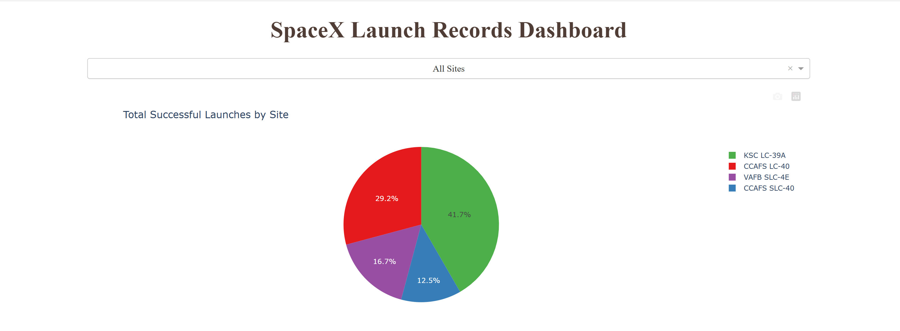
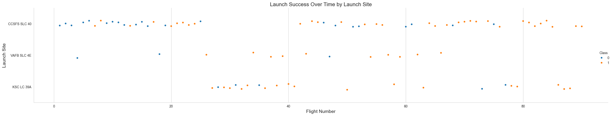
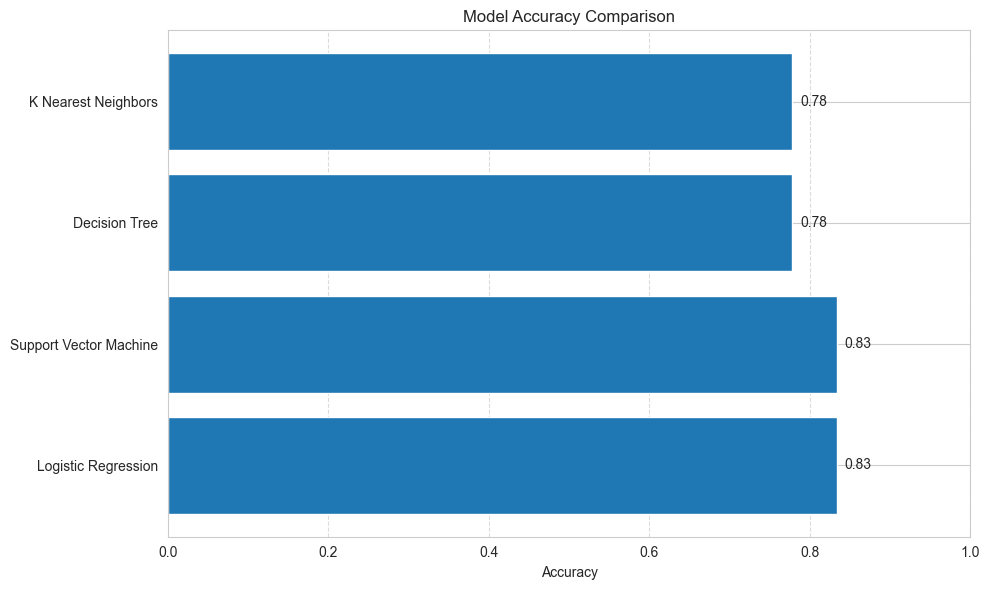
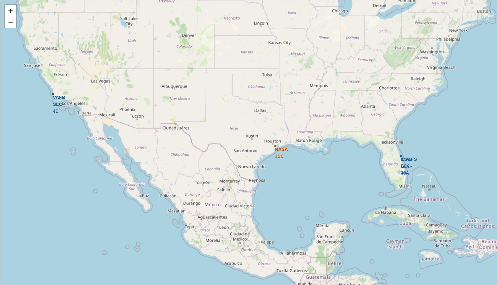
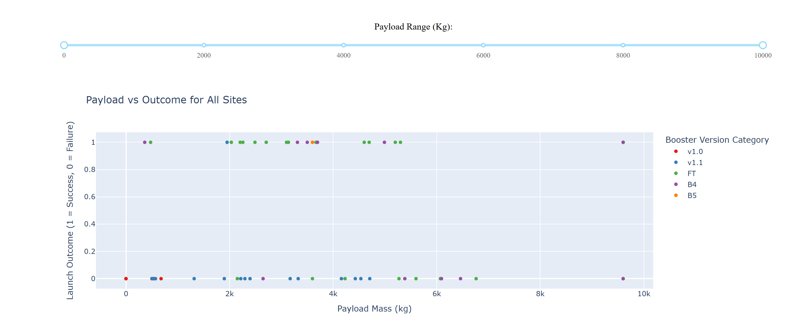

# Mission Control: Predicting Falcon 9 First Stage Landings with Data Science

Can we predict whether a SpaceX Falcon 9 booster will successfully land?  
This project dives deep into Falcon 9 launch records to answer that question using real-world API data, geospatial analysis, and machine learning.



## Project Overview

Successful booster landings are central to SpaceX's cost-efficiency and mission reusability strategy. This end-to-end project uses data science to:

- Enrich raw launch data with metadata via the SpaceX API  
- Explore trends in orbits, payloads, and launch outcomes  
- Visualize launch locations and infrastructure proximity  
- Build predictive models to forecast first-stage landing success

## Repo Structure

```
Mission-Control-Falcon9/  
├── Notebooks/  
│   ├── mission_control_analysis.ipynb        # Main analysis & ML pipeline  
│   └── mission_control_geospatial.ipynb      # Geospatial visualization (bonus)  
│  
├── App/  
│   ├── mission_control_dashboard.py            # Interactive Dash app  
│   └── Data/  
│       └── spacex_launch_dash.csv            # App dataset  
│  
├── Data/                                     # (Empty placeholder or raw data folder)
|    ├─ dataset_part_1.csv                    # Main dataset
|    ├─ falcon9_launch_data_cleaned.csv       # Cleaned dataset
|    └── spacex_launch_geo.csv                #Geospatial dataset
├── Images/                                   # Dashboard screenshots (optional)  
├── README.md                                 # You're here  
```

## Core Capabilities

- **Data Collection & API Integration**  
  Pulled historical launch data via the SpaceX REST API and enriched it with payload, rocket, and recovery metadata.

- **Exploratory Data Analysis (EDA)**  
  Used `pandas`, `matplotlib`, and `seaborn` to uncover trends in payload mass, orbit types, and mission success rates.



- **Geospatial Mapping (Folium)**  
  Interactive map showing launch site locations, proximity to infrastructure (coastlines, roads, cities), and booster success markers.

- **Predictive Modeling**  
  Trained Logistic Regression, SVM, Decision Tree, and KNN classifiers. Best model achieved **83% test accuracy** in predicting landing success.

  

- **Interactive Dashboard (Dash)**  
  A lightweight web app allowing dynamic filtering by launch site and payload mass to explore success trends visually.

##  Extended Analysis & Interactive Components

This project includes two bonus additions that enhance exploration beyond the notebook:

- **[Geospatial Notebook: Launch Site Mapping](mission-control-falcon9-landing/Notebooks/mission_control_geospatial.ipynb)**  
  Visualize launch site placement, environmental proximity, and booster success rates with interactive maps.



- **[Interactive Dashboard: Launch Explorer](app/mission_control_dashboard.py)**  
  A browser-based tool to analyze mission outcomes by launch site, payload mass, and booster version.

  

## Key Findings

- Launch success improved significantly with higher flight numbers, indicating organizational learning.
- Heavier payloads were not necessarily linked to landing failure—especially for LEO and ISS missions.
- Coastal locations and proximity to roads/rail offer strategic advantages for logistics and recovery.
- Logistic Regression and SVM provided the highest predictive accuracy, with most model errors being false positives.

## Datasets & References

- **Main Dataset**: Pulled from [SpaceX REST API](https://github.com/r-spacex/SpaceX-API)  
- **Static JSON Snapshot**: Used for reproducibility during feature engineering  
- **Folium Geo CSV**: Includes lat-long coordinates of launches  
- **Dashboard CSV**: Lightweight filtered dataset for Dash app

> See individual notebooks for detailed preprocessing steps and API call references.

## Tech Stack

- Python (pandas, numpy, requests)
- Visualization: seaborn, matplotlib, folium, plotly
- Machine Learning: scikit-learn
- Interactive App: Dash
- Notebook Runtime: Jupyter

## Future Enhancements

- Add contextual features like weather, time of day, and mission type  
- Experiment with ensemble models (Random Forest, XGBoost)  
- Package model predictions into a deployable Flask API or cloud dashboard  
- Deeper folium visualizations around ocean recovery patterns and landing zones

---

## About This Project

This project is part of a broader portfolio showcasing practical applications of data science across analytics, visualization, and machine learning.  
For more projects, visit [My GitHub Portfolio](https://github.com/dataworksbyj).
